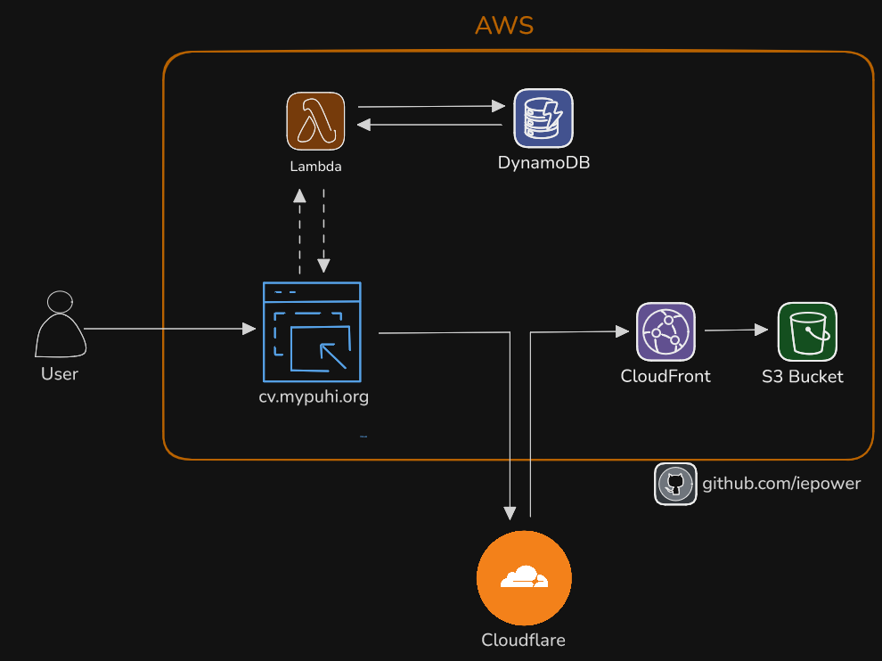

# AWS Cloud Resume Challenge

[](#)

This is my attempt at the cloud resume challenge in AWS. What is Cloud Resume Challenge? – [The Cloud Resume Challenge](https://cloudresumechallenge.dev/) is a multiple-step resume project which helps build and demonstrate skills fundamental to pursuing a career in Cloud. The project was published by Forrest Brazeal.

## Architecture

Here is the architecture for my Cloud Resume project:



## Services Used:
- **S3**
- **AWS CloudFront**
- **Certificate Manager**
- **AWS Lambda**
- **DynamoDB**
- **Cloudflare**
- **GitHub Actions**
- **Terraform**
### What is AWS Lambda?
[AWS Lambda](https://aws.amazon.com/lambda/) is a serverless compute service that allows you to run code without provisioning or managing servers. You can use Lambda to run code in response to events such as HTTP requests, changes in data, or modifications to AWS services. This project uses AWS Lambda to interact with a DynamoDB table to store and update visitor counts for the resume page.

### Code Explanation
The following Lambda function is written in Python. It connects to a DynamoDB table to update and return the view count for the webpage.
Be aware and use YOUR values in the id and table name sections:

```python
import json
import boto3
from decimal import Decimal
from botocore.exceptions import ClientError

dynamodb = boto3.resource('dynamodb')
table = dynamodb.Table('YOUR TABLE NAME')

# Utility function to convert Decimal types to int/float
def decimal_to_int(obj):
    if isinstance(obj, Decimal):
        return int(obj) if obj % 1 == 0 else float(obj)
    raise TypeError

def lambda_handler(event, context):
    try:
        # Retrieve the current item
        response = table.get_item(Key={'id': '0'})
        
        # Check if the item exists
        if 'Item' in response:
            views = response['Item'].get('views', 0)
        else:
            # If the item does not exist, initialize views to 0
            views = 0
        
        # Increment the view count
        views += 1
        print(f"Updated views count: {views}")
        
        # Put the updated item back into the table
        table.put_item(Item={'id': '0', 'views': views})
        
        # Return the result, converting the Decimal object to a regular number
        return {
            'statusCode': 200,
            'body': json.dumps({'views': views}, default=decimal_to_int)
        }
        
    except ClientError as e:
        print(f"An error occurred: {e.response['Error']['Message']}")
        return {
            'statusCode': 500,
            'body': json.dumps({'error': e.response['Error']['Message']})
        }
    except Exception as e:
        print(f"An unexpected error occurred: {str(e)}")
        return {
            'statusCode': 500,
            'body': json.dumps({'error': str(e)})
        }

## Live Demo
[https://cv.mypuhi.org](https://cv.mypuhi.org)
